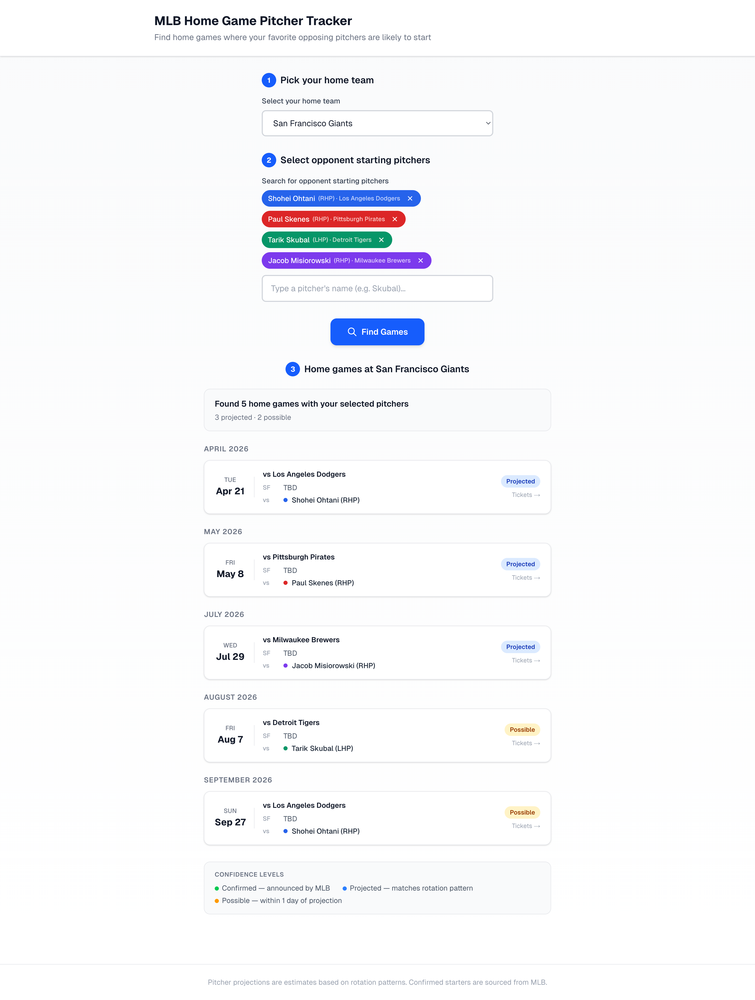

# MLB Home Game Pitcher Tracker

Find home games where your favorite opposing starting pitchers are likely to pitch — and buy tickets directly from MLB.com.

**Try it live:** [mlb-probable-starters-production.up.railway.app](https://mlb-probable-starters-production.up.railway.app/)



## How It Works

1. **Pick your home team** (e.g., San Francisco Giants)
2. **Search and select opponent starting pitchers** (e.g., Shohei Ohtani, Paul Skenes, Tarik Skubal)
3. **View projected home games** where those pitchers are expected to start, with confidence levels
4. **Click a game** to open its MLB.com page and purchase tickets

### Pitcher Rotation Projection

The app uses a series-based projection algorithm:

- Groups home games into series by visiting team
- Analyzes each pitcher's game log to calculate their rotation frequency
- Projects one start per visiting series, picking the most likely game
- Uses MLB's announced probable pitchers as ground truth when available

**Confidence levels:**

- **Confirmed** — MLB has announced this pitcher as the probable starter
- **Projected** — matches the pitcher's rotation pattern
- **Possible** — within 1 day of the projected rotation

### Pitcher Status Warnings

The app detects roster changes that may affect projections:

- **Traded** — pitcher has moved to a different team (auto-updates projections)
- **IL/Inactive** — pitcher hasn't started in 15+ days mid-season
- **No starts** — pitcher has zero starts 3+ weeks into the season

## Tech Stack

- **Next.js 16** (App Router) — server-side API routes to proxy the MLB Stats API (avoids CORS)
- **TypeScript**
- **Tailwind CSS 4**
- **MLB Stats API** (statsapi.mlb.com) — free, public, no API key required

## Getting Started

```bash
npm install
npm run dev
```

Open [http://localhost:3000](http://localhost:3000).

## Project Structure

```
src/
├── app/
│   ├── page.tsx                    # Main page — 3-step flow with localStorage persistence
│   ├── layout.tsx                  # Root layout
│   └── api/
│       ├── teams/route.ts          # GET — all 30 MLB teams
│       ├── players/search/route.ts # GET ?q=name — pitcher search (includes two-way players)
│       ├── player/[id]/route.ts    # GET — player info with current team
│       ├── schedule/route.ts       # GET ?teamId&season — full season schedule
│       └── gamelog/route.ts        # GET ?playerId&season — pitcher game log
├── lib/
│   ├── mlb-api.ts                  # Server-side MLB Stats API fetch helpers
│   ├── projection.ts              # Series-based rotation projection algorithm
│   └── types.ts                   # Shared TypeScript interfaces
└── components/
    ├── TeamPicker.tsx              # Team dropdown grouped by division
    ├── PitcherSearch.tsx           # Debounced search with autocomplete
    ├── PitcherChip.tsx             # Color-coded selected pitcher tag
    ├── ScheduleResults.tsx         # Results list with warnings and legend
    └── GameCard.tsx                # Game card linking to MLB.com tickets
```

## Data Source

All data comes from the [MLB Stats API](https://statsapi.mlb.com). No API key is required. The app proxies requests through Next.js API routes to avoid browser CORS restrictions.

## Features

- Selections (home team + pitchers) persist in localStorage across page reloads
- Supports two-way players (e.g., Shohei Ohtani)
- Falls back to previous season game logs early in the season
- Shows home team's probable starter when announced by MLB
- Each game card links directly to its MLB.com gameday page for ticket purchases

## License

This project is licensed under the Apache License 2.0. See [LICENSE](LICENSE) for details.
